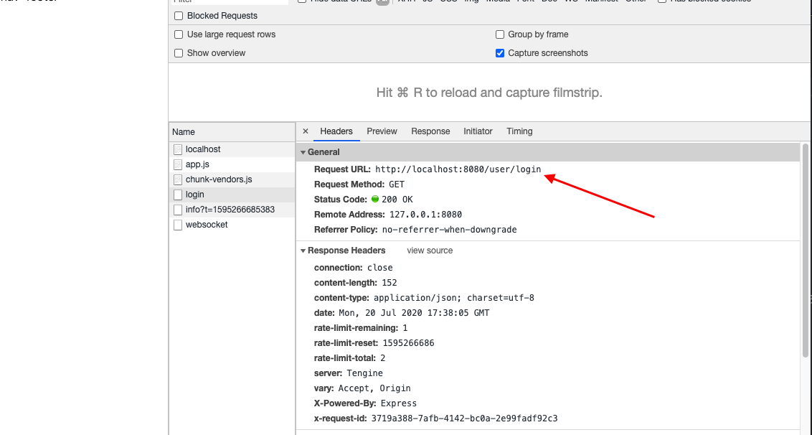
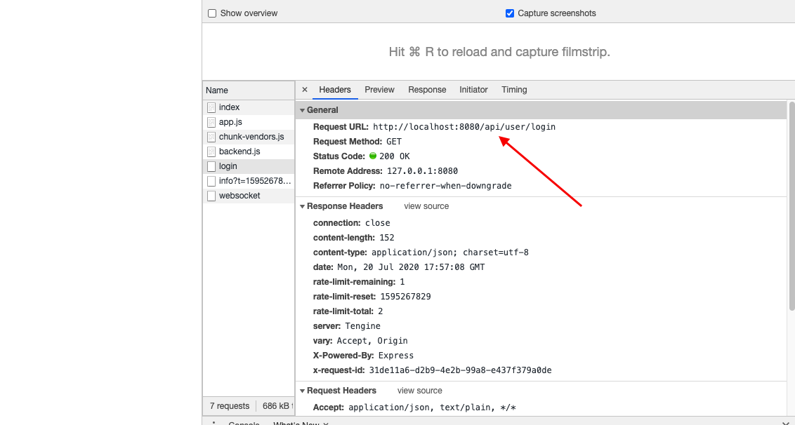
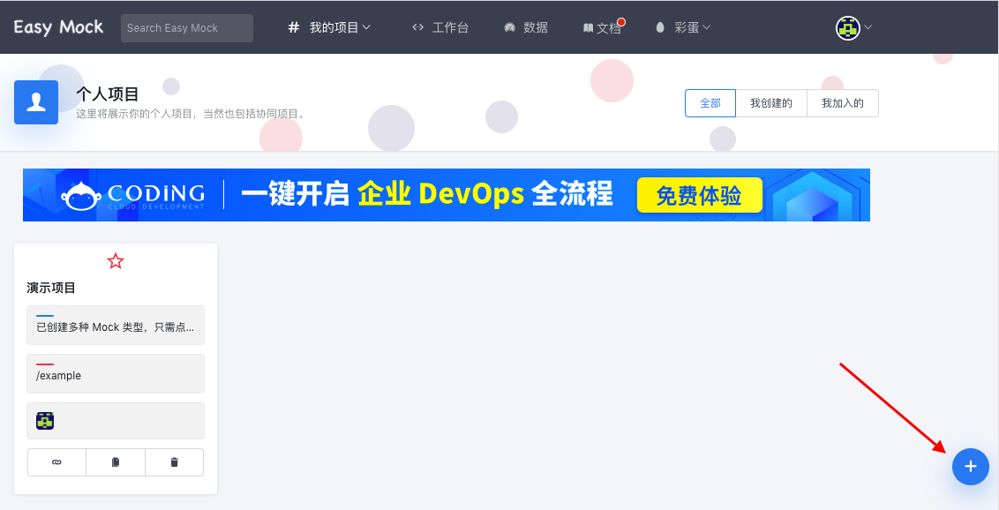
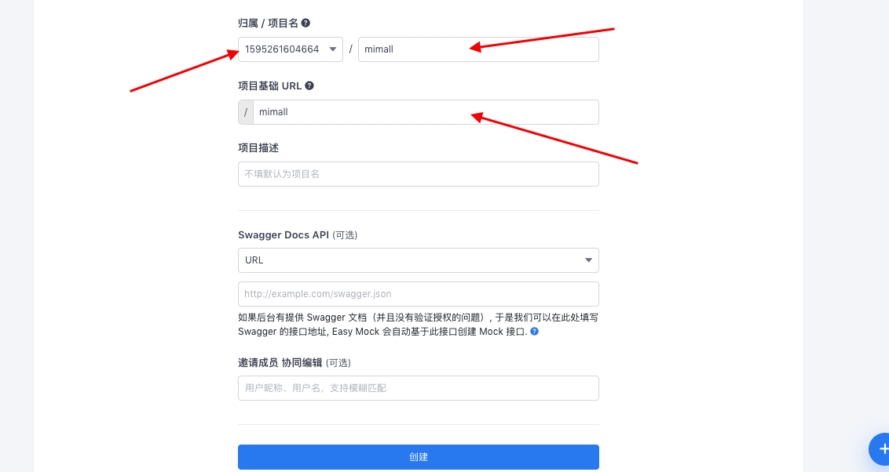
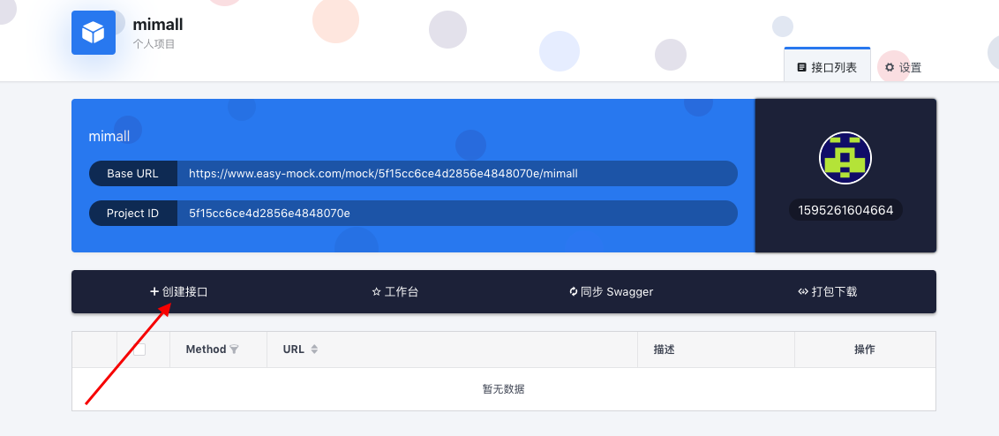
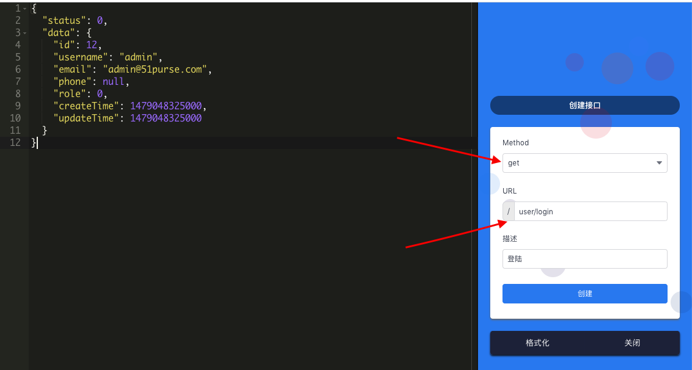

# 零散笔记

## 跨域

### 接口代理

*    通过修改nginx服务器配置来实现
*    说明：前端修改，后台不动
*    示例

#### 单个接口的拦截

例如我们的接口地址是 https://www.easy-mock.com/mock/5f15cc6ce4d2856e4848070e/mimall/login/user ，假设我们需要对该接口进行拦截，首先需要在vue.config.js中进行配置：

```js
// 注意：每次修改完配置文件都需要重新启动项目
module.exports = {
    devServer: {
        host: 'localhost',
        port: 8080,
        proxy: {
            '/user': { // 添加接口代理
                target: 'https://www.easy-mock.com/mock/5f15cc6ce4d2856e4848070e/mimall',
                changeOrigin: false
            }
        }
    }
}
```

在vue的生命周期钩子中通过axios请求该文件：

```js
mounted() {
	this.$http.get('/user/login').then(res => {
		console.log(res)
	})
}
```

通过接口代理的方式，可以将我们对`/user/login` 的访问，自动转发到对 `https://www.easy-mock.com/mock/5f15cc6ce4d2856e4848070e/mimall/user/login` 的访问，这样做的好处是，在url的请求头中，不会暴露真实的接口地址。



---

#### 多个接口的拦截

上面的接口拦截存在一个问题，那就是只能对单一的接口进行拦截，但如果我们有很多的接口呢，是不是需要写一堆的拦截呢？答案是否定的，那如何能做到多个接口的统一拦截呢？

```js
// 注意：每次修改完配置文件都需要重新启动项目
module.exports = {
    devServer: {
        host: 'localhost',
        port: 8080,
        proxy: {
            '/api': { // 添加接口代理
                target: 'https://www.easy-mock.com/mock/5f15cc6ce4d2856e4848070e/mimall',
                changeOrigin: true,
                pathRewrite: {
                    '/api': ''
                }
            }
        }
    }
}
```

在vue的生命周期钩子中通过axios请求该文件：

```js
mounted() {
	this.$http.get('/api/user/login').then(res => {
		console.log(res)
	})
}
```

同样的，我们依旧能够请求到数据，只是请求的地址略有调整：



---

### cords/jsonp跨域

*    示例

配置环境变量：在src>env.js，为不同的环境配置不同的baseURL

```js
let baseURL

switch (process.env.NODE_ENV) {
case 'development':
    baseURL = 'http://dev-mall-pre.springboot.cn/api'
    break
case 'production':
    baseURL = 'http://mall-pre.springboot.cn/api'
    break
default:
    baseURL = 'http://mall-pre.springboot.cn/api'
    break
}

export default {
    baseURL
}
```

main.js配置修改：

```js
import env from './env'
axios.defaults.baseURL = env.baseURL
```

---

## ESLint

```js
// eslint常用配置
rules: {
    // 缩进
    'indent': ['error', 4],
    // 禁用函数名和括号之间的空格
    'space-before-function-paren': 0,
    // 控制vue文件的script标签缩进
    'vue/script-indent': ['error', 4, {'baseIndent': 1}]
},
// 对vue文件的script标签关闭indent缩进规则
overrides: [{
    'files': ['*.vue'],
    'rules': {
        'indent': 'off'
    }
}]
```

---

## Element-UI

```js
// 按需导入
module.exports = {
    presets: [
        ['@babel/preset-env', {modules: false}]
    ],
    plugins: [
        '@babel/plugin-syntax-dynamic-import'
    ]
}
```

---

## 别名配置

```js
const path = require('path')
function resolve(dir) {
    return path.join(__dirname, dir)
}

module.exports = {
    configureWebpack: {
        resolve: {
            alias: {
                src: resolve('src'),
                common: resolve('src/common'),
                components: resolve('src/components')
            }
        }
    }
}
```

---

## mock

### 本地创建json

*    优点
    *    简单

*    缺点
    *    需要修改代码
    *    接口地址并不是真实地址，和后端对接的时候需要修改接口地址

*    示例

新建public>mock>user>login.json

```json
{
	"status": 0,
	"data": {
    	"id": 12,
    	"username": "admin",
    	"email": "admin@51purse.com",
    	"phone": null,
    	"role": 0,
    	"createTime": 1479048325000,
    	"updateTime": 1479048325000
	}
}
```

在vue的生命周期钩子中通过axios请求该文件：

```js
mounted() {
    // 注意请求路径不是：/public/mock/user/login.json
	this.$http.get('/mock/user/login.json').then(res => {
		console.log(res)
	})
}
```

---

### easy-mock平台

通过easy-mock平台实现数据mock：

*    示例

登陆[easy-mock平台](https://www.easy-mock.com/)，点击右下角的创建项目：



填上项目归属、名称及URL：



进入对应的项目主页，点击创建接口：





main.js相关配置：

```js
axios.defaults.baseURL = 'https://www.easy-mock.com/mock/5f15cc6ce4d2856e4848070e/mimall'
```

在vue的生命周期钩子中通过axios请求该地址：

```js
mounted() {
	this.$http.get('/user/login').then(res => {
		console.log(res)
	})
}
```

---

### 集成Mock API

本地集成mockjs实现数据mock：

*    优点
    *    代码污染小

*    示例

本地安装mock.js

```bash
$ npm install --save-dev mock.js
```

main.js相关配置：

```js
// mock开关 --> 开关打开才去拦截请求
const mock = true
if (mock) {
    // require是实时导入，import要预编译
    require('./mock/api')
}
```

在 src>mock>api.js

```js
import Mock from 'mockjs'
Mock.mock('/api/user/login', {
    status: 0,
    data: {
        id: 12,
        username: 'admin',
        email: 'admin@51purse.com',
        phone: null,
        role: 0,
        createTime: 1479048325000,
        updateTime: 1479048325000
    }
})
```

