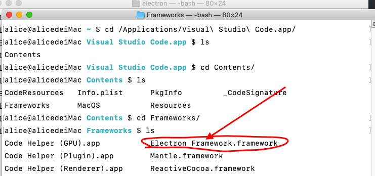

# electron


### 如何快速判断一个应用是否使用electron构建

首先，进入该项目的根目录下

```bash
$ cd /Applications/Visual\ Studio\ Code.app/
```

找到Contens目录

```bash
$ cd Contents/
```

打开Frameworks

```bash
$ cd Frameworks && ls
```

如果看到 Electron Framework.framework，则说明该应用是基于 electron 构建的



