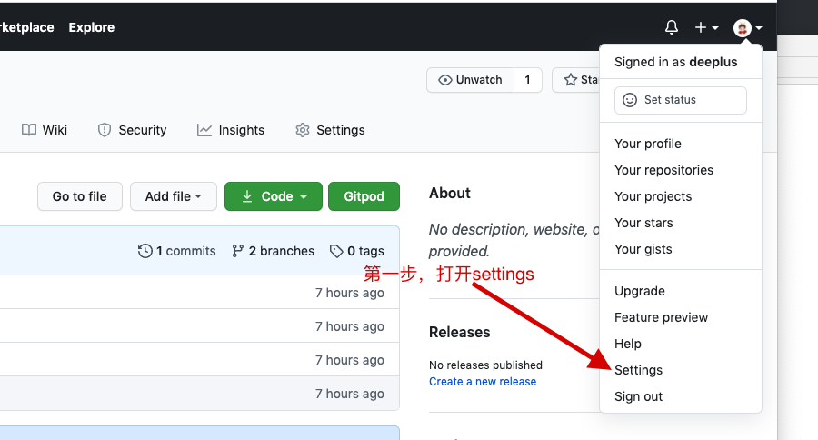
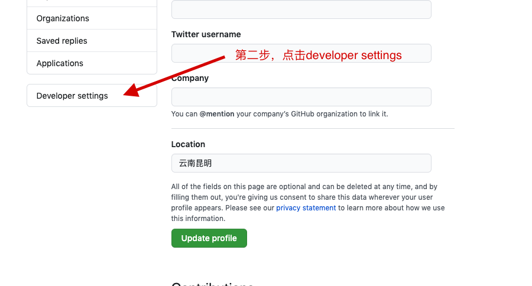
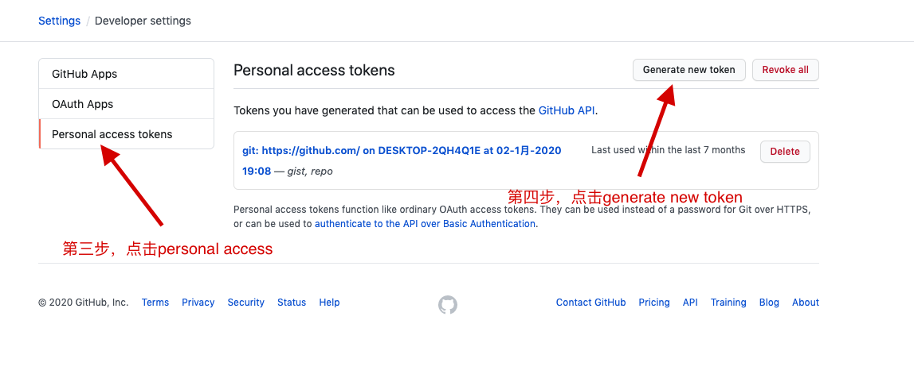
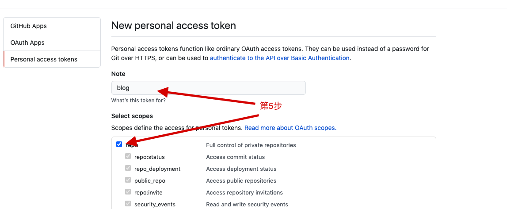
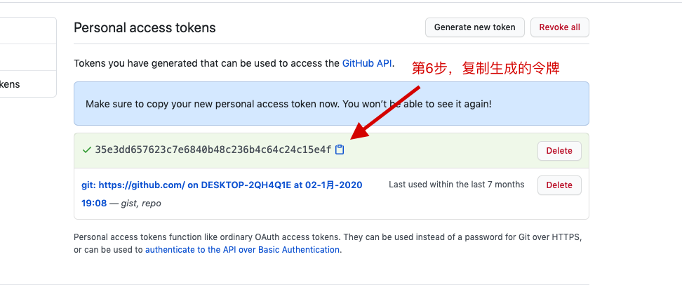
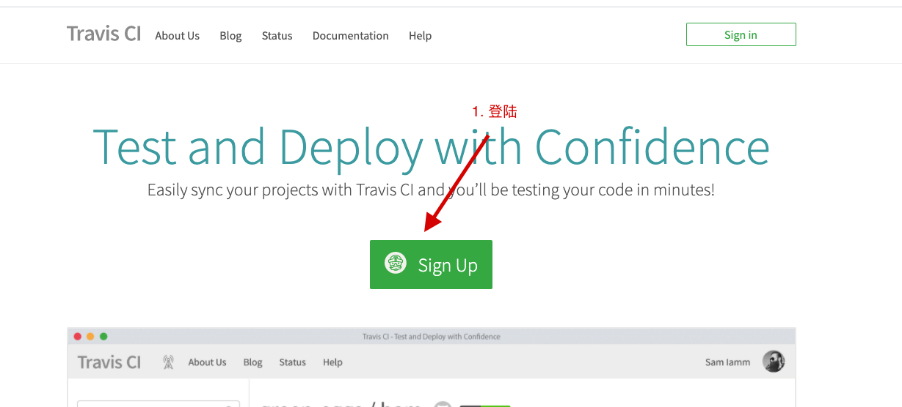
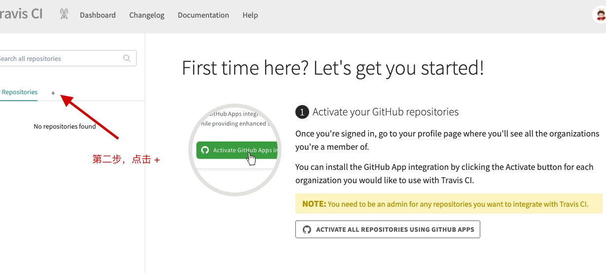
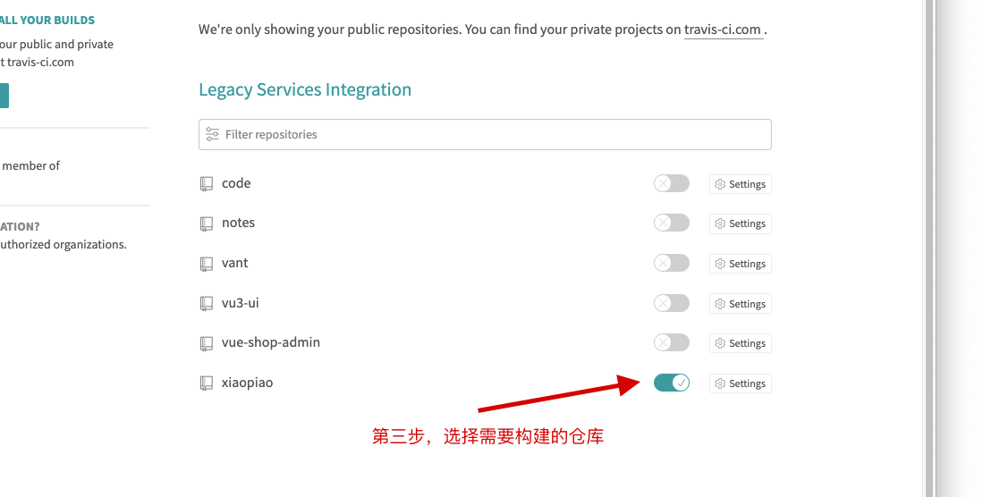
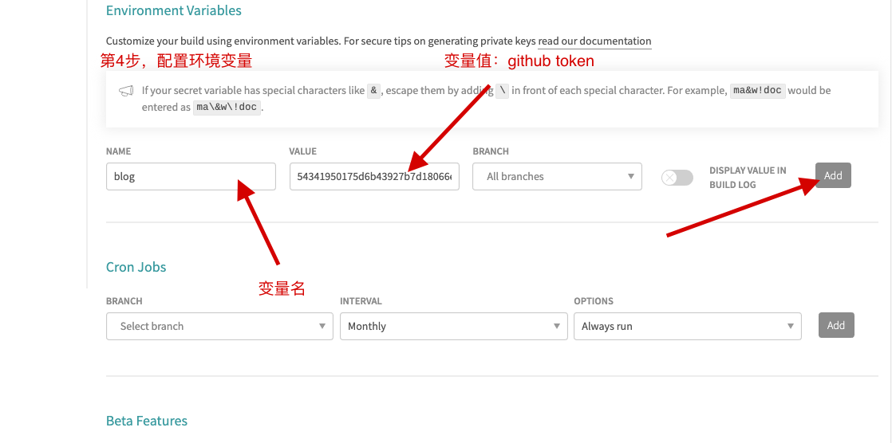

#  Travis CI

>   Travis CI 是一个在线托管的持续集成服务(Continuous Interation，简称CI)，它能够很好的和Github进行配合，每当有新的代码提交，它就会去自动抓取，然后提供一个运行环境，执行测试、完成构建、甚至是部署到服务器。

---

## 什么是持续集成

```css
54341950175d6b43927b7d18066e7837762717f1
```


​	持续集成指的是 只要有代码变更，就自动运行构建和测试，反馈运行结果。确保符合预期以后，再将新代码"集成"到主干。持续集成的好处在于，每次代码的小幅变更，就能看到运行结果，从而不断累积小的变更，而不是在开发周期结束时，一下子合并一大块代码。

---

## 使用Travis Ci

​	在这里我们将模拟如何使用travis-ci将vue项目部署到 github pages

### 创建github token











---

### 配置Travis CI







接下来，进入到目标仓库：设置环境变量，然后点击右侧的 Add 按钮



---

### 配置.travis.yml

```yml
# 运行环境
language: node_js

# node.js版本 - node 表示最新版
node_js:
	- "node"

# 要显示缓存的依赖项
cache: npm
	
 script: npm run build
 	
 after_script:
 	- cd ./public
 	- git init
 	- git config -user.name ""
    - git config -user.email ""
    - git add .
    - git commit -m ""
    - git push --force --quiet "https://${GITHUB_REPO_TOKEN}@${GH_REF}" master:gh-pages
    
# 指定分支，只有指定的分支提交时才会运行脚本
branches:
	only: 
		- master
		
# 环境变量
env:
	global:
		- GH_REF: github.com/deeplus/blog.git
```


